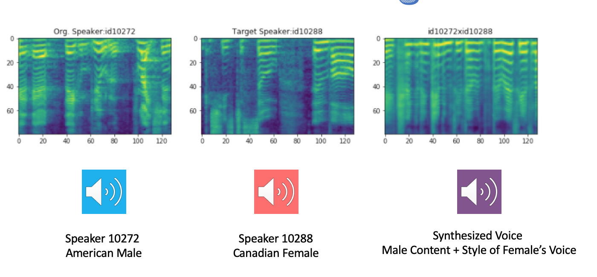
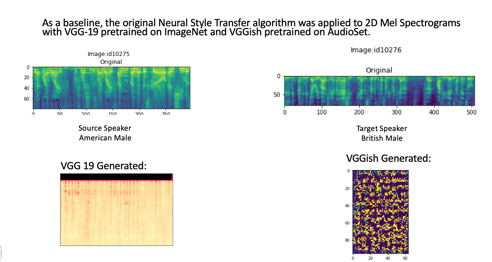

# Exploring Voice Conversion Using Generative Approaches

Niral Shah

Stanford CS230 Deep Learning 

Professor Andrew Ng

Project Video: https://youtu.be/mFmF104wlrw

## Content:
This repo contains several Voice Conversion Techniques tried using generative deep learning methods: 

- `/autovc` 
    - An autoencoder-decoder Voice Conversion Technique using [AutoVC](https://arxiv.org/abs/1905.05879)
    
    - Pytorch Implementation forked off https://github.com/auspicious3000/autovc

    - See TensorFlow Implementation `autovc/AutoVC-Tensorflow.py` 

    - Additionally added a custom notebooks to get test_metadata for custom voice conversion. 

    - Training on VoxCeleb1 dataset for Zero Shot Voice Conversion

    - Download [model checkpoints](https://drive.google.com/drive/folders/1lumwj3ijr0SMvWGWo-HM_RjgNUHiqGnQ?usp=sharing)

    - Download [my custom weights](https://drive.google.com/drive/folders/1lumwj3ijr0SMvWGWo-HM_RjgNUHiqGnQ?usp=sharing)

    - See `autovc_vc_sample.wav` for a sample male to female voice conversion attempt. 
    - 

-   `audio_neural_style_transfer_vgg19.py`
    - Re-implemented [Neural Style Transfer](https://www.cv-foundation.org/openaccess/content_cvpr_2016/papers/Gatys_Image_Style_Transfer_CVPR_2016_paper.pdf) using pre-trained VGG19 but using Mel-Spectrogram for Audio Style Transfer
    - See `final_ast.wav ` for sample after 1000 iterations (very noisy). 

    - Results:
        - 

- `audio_neural_style_transfer_vggish.py` 
    - Similarly applied the Neural Style Transfer algorithm but used a pretrained VGGish (audioset weights)

    - See `vggish_sample.wav` for sample after 1000 iterations (also very noisy). 

- `neural-style-audio-tf`  
    - Fork of https://github.com/DmitryUlyanov/neural-style-audio-tf , which applies the Neural Style Transfer algorithm using a shallow wide randomly initialized 1D conv net.

    - See `ulyanov_sample.wav` for sample male to female voice conversion attempt

    - Results after 500 iterations:
        - Input:
            - 

- `notebooks/` 
    - See several helper notebooks implemented in the exploration phase. May be useful to get started. 

## System Diagram:

